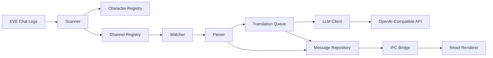
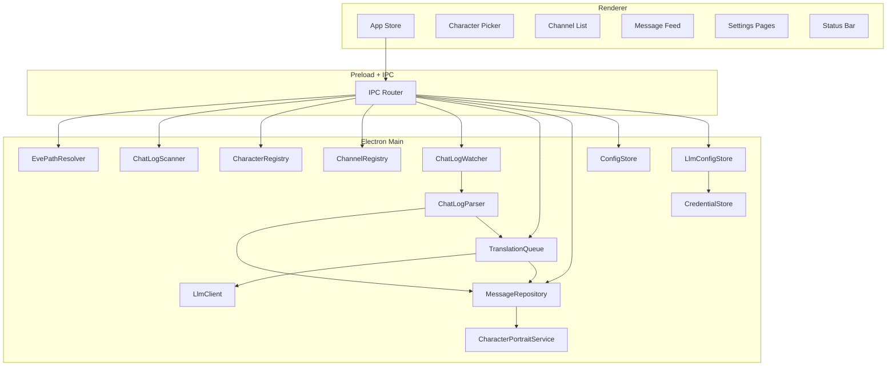

# EVE Babel

[English](./README.md) | [简体中文](./README.zh-CN.md) | 日本語 | [Русский](./README.ru.md)

<div align="center">

Windows を主対象とした EVE Online チャットログのリアルタイム翻訳デスクトップアプリ


</div>

## 概要

EVE Babel は EVE Online プレイヤー向けに作られたデスクトップアプリです。主な目的は、Windows 上のローカルチャットログを、閲覧しやすく、チャンネル単位で制御でき、リアルタイムに翻訳されるメッセージストリームへ変換することです。

このアプリはローカルの EVE チャットログディレクトリを自動検出し、まず特定の character を選択させ、その character に対して利用可能な chat channel を列挙します。ユーザーが必要なチャンネルを有効化すると、それらのログファイルに追記される新しい内容を継続的に監視し、OpenAI 互換 API に送って翻訳します。UI では原文、訳文、状態、コンテキストをまとめて表示します。

現在このプロジェクトは、非常に明確な MVP の目標に集中しています。

> ログを発見し、character を選択し、channel を有効化し、新着メッセージを監視し、それらを安定してリアルタイム翻訳すること。

## 解決しようとしている課題

EVE Online のチャットは、特に多言語環境では流れが非常に速くなります。プレイヤーはゲーム画面、未加工のログファイル、外部翻訳ツールを何度も行き来しがちです。このコンテキスト切り替えはノイズを増やし、反応速度を落とします。

EVE Babel は、これをより整理されたワークフローに置き換えることを目指しています。

- Windows 上のチャットログを自動検出する
- character ごとにデータを分離する
- channel 単位で翻訳を制御する
- 新たに追記されたメッセージだけをリアルタイムで処理する
- 最近のメッセージと翻訳結果をローカルにキャッシュする

## 主な機能

| 機能 | 説明 |
| --- | --- |
| ログの自動検出 | Windows の Documents 配下にある EVE チャットログディレクトリを検出し、必要に応じて手動指定にも対応 |
| character 優先のフロー | ユーザーが最初に character を選択し、その character に対応する channel と message だけを表示・処理 |
| channel 検出と opt-in 制御 | 利用可能な channel を自動検出し、明示的に有効化したものだけがライブ翻訳パイプラインに入る |
| リアルタイムログ監視 | アクティブなチャットログファイルを監視し、新たに追記された内容だけを処理 |
| 原文と訳文の並列表示 | タイムスタンプ、送信者、channel、原文、翻訳状態、訳文をまとめて表示 |
| OpenAI 互換 provider 対応 | OpenAI、DeepSeek、OpenRouter、およびカスタム互換エンドポイントに対応 |
| ローカル永続化 | 最近のメッセージ、翻訳、設定、provider profile、実行時状態をローカルに保存 |

## 現在のプロダクト範囲

### 現行バージョンに含まれるもの

- Windows 優先のデスクトップ体験
- 既定ログディレクトリの自動検出
- 自動検出に失敗した場合の手動ディレクトリ選択
- channel 選択の前に character を選ぶフロー
- 選択した character の channel 一覧
- channel ごとの有効化と pin 操作
- 翻訳状態付きのライブメッセージフィード
- 設定可能な対象言語
- 設定可能な OpenAI 互換 provider profile
- 最近のメッセージと翻訳のキャッシュ

## 使い方

### ユーザーフロー

1. アプリを起動します。
2. EVE Babel はまずローカルの EVE チャットログディレクトリを自動的に特定しようとします。
3. 自動検出に失敗した場合、ユーザーは正しいディレクトリを手動で選択できます。
4. アプリはディレクトリをスキャンし、利用可能な character 一覧を構築します。
5. ユーザーは使用したい character を選択します。
6. アプリはその character に対して検出されたすべての channel を表示します。
7. ユーザーは追跡して翻訳したい channel を有効化します。
8. 新たに追加されたチャット内容が解析され、翻訳キューへ送られます。
9. 翻訳結果は UI に反映され、ローカルストレージにも保存されます。

### 実行時データフロー



## 技術アーキテクチャ

EVE Babel は、安定性・セキュリティ・将来の拡張性を最優先事項として設計された、レイヤー化された Electron アーキテクチャを採用しています。

### 1. Main process

Electron の main process は、システムに近い処理とセキュリティ上重要な責務をすべて担います。

- ログディレクトリの検出と検証
- ファイルスキャンと watcher のライフサイクル管理
- UTF-16LE チャットログの解析
- character と channel のインデックス管理
- 翻訳キューのオーケストレーション
- OpenAI 互換 API リクエスト
- ローカル永続化と設定保存
- API key の取り扱い
- renderer への実行時イベント配信

これにより、ファイルシステムアクセス、翻訳実行、認証情報の取り扱いを UI 層の外に保てます。

### 2. Preload bridge

preload 層は、renderer に対して最小限の IPC API を公開します。これは React UI と権限を持つ Electron main process の間の制御された境界として機能します。

renderer が現在要求できる主な操作は次のとおりです。

- bootstrap データの取得
- channel message のページング取得
- character の選択
- channel の有効化または pin
- 設定の更新
- provider profile の管理
- ログディレクトリの選択

また、main process から push される次のイベントも購読します。

- message 更新
- channel 状態更新
- watcher と API の状態更新
- character portrait 更新

### 3. Renderer

React renderer は、以下を含むプロダクト体験の構成と表示を担当します。

- character picker
- channel list
- message feed
- settings pages
- status bar
- provider 設定 UI

renderer 自体は、ファイルを直接読んだり、翻訳リクエストを直接送ったりはしません。

### 4. Shared types

プロセス間で共有されるデータ構造は、共通の TypeScript 型によって制約されています。主なモデルは次のとおりです。

- `CharacterSummary`
- `ChannelSummary`
- `ChatMessage`
- `ChatSessionFile`
- `TranslationJob`
- `AppConfig`
- `BootstrapPayload`
- `WatcherStatus`
- `ApiStatus`

これにより IPC 契約が明示的になり、main process と renderer の間での型のズレを減らせます。

## アーキテクチャ概要



## 技術スタック

| レイヤー | 技術 |
| --- | --- |
| Desktop Shell | Electron |
| Frontend | React 19 |
| Language | TypeScript |
| Build Tooling | electron-vite + Vite |
| File Watching | chokidar |
| Local Data Storage | sql.js |
| i18n | i18next + react-i18next |
| Packaging | electron-builder |
| Testing | Vitest |

## プロジェクト構成

```text
src/
  main/
    ipc/
    services/
      channelRegistry.ts
      characterRegistry.ts
      chatLogParser.ts
      chatLogScanner.ts
      chatLogWatcher.ts
      configStore.ts
      credentialStore.ts
      evePathResolver.ts
      llmClient.ts
      llmConfigStore.ts
      messageRepository.ts
      translationQueue.ts
    main.ts
    preload.ts
  renderer/
    components/
      settings/
    i18n/
    store/
    App.tsx
    main.tsx
    styles.css
  shared/
    types.ts
spec/
  design_plan.md
scripts/
  prepare-package-output.ps1
```

## データモデルとログ解析の方針

EVE のチャットログ構造は、実装戦略に直接影響します。

- ログはローカルの Windows チャットログディレクトリから取得される
- ファイル名には channel 名、日付、時刻、character ID が含まれる
- channel 名にはスペース、ドット、括弧、非英語文字が含まれる場合がある
- ファイル内容は UTF-16LE として解析する必要がある
- パーサーは BOM の重複、ヘッダーメタデータ、システム行、途中書き込みの行を許容しなければならない
- watch モードでは新たに追記された内容だけを読み取り、不要に全履歴を再処理してはならない

こうした制約があるため、このプロジェクトではすべてを UI に押し込むのではなく、scanner、watcher、parser、repository、translation queue の責務を意図的に分離しています。

## セキュリティとプライバシー

セキュリティ境界はアーキテクチャの一部として扱われています。

- API リクエストは Electron の main process から送信される
- renderer が受け取るのはホワイトリスト化された preload API のみ
- API key はローカルに保存され、利用可能な場合は Electron の `safeStorage` で暗号化される
- チャットデータと翻訳はプロダクト動作のためにローカル保存されるが、別個の分析アップロード基盤としては扱われない
- UI は任意のファイルシステムアクセスや任意のネットワークアクセスを必要としない

## ローカル開発

### 要件

- Windows 推奨
- Node.js LTS
- npm
- 利用可能な OpenAI 互換 API エンドポイントと API key
- ローカルで利用できる EVE Online のチャットログ

### 依存関係のインストール

```bash
npm install
```

### 開発環境の起動

```bash
npm run dev
```

### テスト実行

```bash
npm run test
```

### 型チェック

```bash
npm run typecheck
```

### アプリのビルド

```bash
npm run build
```

### パッケージ出力の生成

```bash
npm run pack
```

### Windows インストーラー出力の生成

```bash
npm run dist
```

## 初回起動時の流れ

初回起動時に想定されるフローは次のとおりです。

1. アプリが既定の EVE チャットログディレクトリを確認する
2. ディレクトリが存在しない、または利用できない場合は、ユーザーが手動で選択する
3. アプリがスキャンを行い、利用可能な character を一覧表示する
4. ユーザーがアクティブな character を選ぶ
5. ユーザーが settings を開き、翻訳 provider を設定する
6. ユーザーが翻訳したい channel を有効化する
7. 新しいチャットメッセージが状態パイプラインを流れ、翻訳結果付きで表示される

## 対応している Provider モデル

現在の実装は OpenAI 互換 API を前提としており、現時点で以下をサポートしています。

- OpenAI
- DeepSeek
- OpenRouter
- カスタム互換エンドポイント

目的は、翻訳レイヤーを単一ベンダーに強く結び付けるのではなく、交換可能なままに保つことです。

## テスト戦略

このリポジトリには、すでに次のようなコアサービスに対する単体テストが含まれています。

- チャットログ解析
- ディレクトリスキャン
- watcher の挙動
- 翻訳キューロジック
- LLM client と設定処理
- repository と選択ロジック

これは意図的です。このプロダクトで最も壊れやすいのはビジュアルレイアウトではなく、ログ形式の取り扱い、増分読み取り、キュー制御、ローカル永続化の境界だからです。

## パッケージングと配布

このプロジェクトは `electron-builder` を使ってパッケージングしており、現在は x64 Windows 向けの Windows NSIS インストーラー出力を対象としています。

## FAQ

### なぜ channel を選ぶ前に character を選ぶ必要があるのですか？

同じ channel 名が、異なる character のログセットに現れる場合があるためです。character を先に選ぶことが、無関係なログの混在を防ぎ、明確なデータ境界を保つ最も分かりやすい方法です。

### なぜ最初からすべての channel を翻訳しないのですか？

channel 単位の opt-in にすることでノイズを減らし、API コストを制御し、UI をユーザーが本当に気にしている内容に集中させられます。

## 免責事項

これは独立したプロジェクトであり、CCP Games とは提携していません。
本ソフトウェアの使用により、ユーザーの EVE Online アカウントに対して、制限、停止、BAN を含むがこれらに限定されない公式措置が取られた場合でも、本ソフトウェアおよびその開発者は一切の責任を負いません。