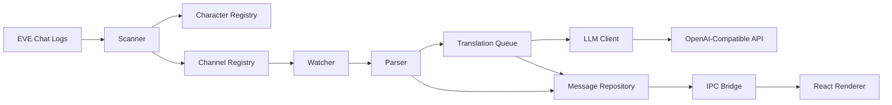
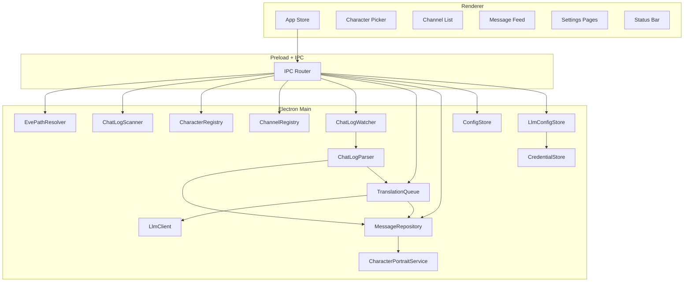

# EVE Babel

English | [简体中文](./README.zh-CN.md) | [日本語](./README.ja.md) | [Русский](./README.ru.md)

<div align="center">

Windows-first desktop app for real-time translation of EVE Online chat logs


</div>

## Overview

EVE Babel is a desktop application built for EVE Online players. Its core goal is to turn local chat logs on Windows into a message stream that is readable, channel-controlled, and translated in real time.

The app automatically discovers the local EVE chat log directory, asks the user to select a specific character first, then enumerates all available chat channels for that character. Once the user enables the channels they care about, the app continuously watches new content appended to those log files and sends incoming messages through an OpenAI-compatible API for translation, showing the original text, translated text, status, and context together in the UI.

This project is currently focused on one very specific MVP goal:

> discover logs, select a character, enable channels, watch new messages, and translate them reliably in real time.

## What Problem It Solves

EVE Online chat moves quickly, especially in multilingual environments. Players often have to switch between the game, raw log files, and external translation tools. That context switching adds noise and slows down response time.

EVE Babel is designed to reduce that friction with a cleaner workflow:

- automatically discover chat logs on Windows
- isolate data by character
- control translation at the channel level
- process only newly appended messages in real time
- cache recent messages and translations locally

## Core Features

| Feature | Description |
| --- | --- |
| Automatic log discovery | Detects the EVE chat log directory under the Windows Documents path and supports manual override when needed |
| Character-first workflow | The user selects a character first, then only the channels and messages for that character are shown and processed |
| Channel discovery and opt-in control | Available channels are discovered automatically, and only explicitly enabled channels enter the live translation pipeline |
| Real-time log watching | Watches active chat log files and processes only newly appended content |
| Side-by-side original and translated content | Shows timestamp, sender, channel, original message, translation status, and translated text together |
| OpenAI-compatible provider support | Supports OpenAI, DeepSeek, OpenRouter, and custom compatible endpoints |
| Local persistence | Stores recent messages, translations, config, provider profiles, and runtime state locally |

## Current Product Scope

### Included in the current version

- Windows-first desktop experience
- automatic default log directory detection
- manual directory selection when auto-detection fails
- character selection before channel selection
- channel list for the selected character
- per-channel enable and pin controls
- live message feed with translation status
- configurable target language
- configurable OpenAI-compatible provider profiles
- recent message and translation caching

## How To Use It

### User flow

1. Launch the app.
2. EVE Babel first tries to locate the local EVE chat log directory automatically.
3. If auto-discovery fails, the user can choose the correct directory manually.
4. The app scans the directory and builds the available character list.
5. The user selects the character they want to use.
6. The app shows all discovered channels for that character.
7. The user enables the channels they want to follow and translate.
8. Newly appended chat content is parsed and pushed into the translation queue.
9. Translated results are pushed back into the UI and written to local storage.

### Runtime data flow



## Technical Architecture

EVE Babel uses a layered Electron architecture with stability, security, and future extensibility as first-order concerns.

### 1. Main process

The Electron main process owns all system-facing and security-sensitive responsibilities:

- log directory discovery and validation
- file scanning and watcher lifecycle management
- UTF-16LE chat log parsing
- character and channel indexing
- translation queue orchestration
- OpenAI-compatible API requests
- local persistence and configuration storage
- API key handling
- runtime event delivery to the renderer

This keeps file system access, translation execution, and credential handling out of the UI layer.

### 2. Preload bridge

The preload layer exposes a minimal IPC API to the renderer. It acts as a controlled boundary between the React UI and the privileged Electron main process.

The renderer can currently request actions such as:

- fetching bootstrap data
- loading paged channel messages
- selecting a character
- enabling or pinning channels
- updating settings
- managing provider profiles
- choosing the log directory

It also subscribes to main-process push events for:

- message updates
- channel state updates
- watcher and API status updates
- character portrait updates

### 3. Renderer

The React renderer is responsible for organizing and presenting the product experience, including:

- the character picker
- the channel list
- the message feed
- settings pages
- the status bar
- provider configuration UI

The renderer itself does not directly read files or send translation requests.

### 4. Shared types

Cross-process data structures are constrained through shared TypeScript types. Core models include:

- `CharacterSummary`
- `ChannelSummary`
- `ChatMessage`
- `ChatSessionFile`
- `TranslationJob`
- `AppConfig`
- `BootstrapPayload`
- `WatcherStatus`
- `ApiStatus`

This keeps the IPC contract explicit and reduces drift between the main process and the renderer.

## Architecture Overview



## Tech Stack

| Layer | Technology |
| --- | --- |
| Desktop Shell | Electron |
| Frontend | React 19 |
| Language | TypeScript |
| Build Tooling | electron-vite + Vite |
| File Watching | chokidar |
| Local Data Storage | sql.js |
| i18n | i18next + react-i18next |
| Packaging | electron-builder |
| Testing | Vitest |

## Project Structure

```text
src/
  main/
    ipc/
    services/
      channelRegistry.ts
      characterRegistry.ts
      chatLogParser.ts
      chatLogScanner.ts
      chatLogWatcher.ts
      configStore.ts
      credentialStore.ts
      evePathResolver.ts
      llmClient.ts
      llmConfigStore.ts
      messageRepository.ts
      translationQueue.ts
    main.ts
    preload.ts
  renderer/
    components/
      settings/
    i18n/
    store/
    App.tsx
    main.tsx
    styles.css
  shared/
    types.ts
spec/
  design_plan.md
scripts/
  prepare-package-output.ps1
```

## Data Model and Log Parsing Approach

The structure of EVE chat logs directly shapes the implementation strategy:

- logs come from the local Windows chat log directory
- filenames encode the channel name, date, time, and character ID
- channel names may contain spaces, dots, parentheses, and non-English characters
- file content must be parsed as UTF-16LE
- the parser must tolerate repeated BOM markers, header metadata, system lines, and partially written lines
- watch mode must only consume newly appended content and never re-process the full history unnecessarily

Because of those constraints, the project deliberately separates scanner, watcher, parser, repository, and translation queue responsibilities instead of pushing everything into the UI.

## Security and Privacy

Security boundaries are treated as part of the architecture.

- API requests are issued from the Electron main process
- the renderer only receives a whitelisted preload API
- API keys are stored locally and use Electron `safeStorage` encryption when available
- chat data and translations are cached locally for product behavior, not as a separate analytics upload pipeline
- the UI does not need arbitrary file system or arbitrary network access

## Local Development

### Requirements

- Windows is recommended
- Node.js LTS
- npm
- a working OpenAI-compatible API endpoint and API key
- locally available EVE Online chat logs

### Install dependencies

```bash
npm install
```

### Start the development environment

```bash
npm run dev
```

### Run tests

```bash
npm run test
```

### Run type checking

```bash
npm run typecheck
```

### Build the app

```bash
npm run build
```

### Generate packaged output

```bash
npm run pack
```

### Generate Windows installer output

```bash
npm run dist
```

## First-Run Experience

On first launch, the expected flow is:

1. the app checks the default EVE chat log directory
2. if the directory is missing or unavailable, the user selects it manually
3. the app scans and lists available characters
4. the user selects the active character
5. the user opens settings and configures the translation provider
6. the user enables the channels they want translated
7. new chat messages begin flowing through the status pipeline and appear with translated output

## Supported Provider Model

The current implementation is built around OpenAI-compatible APIs and currently includes support for:

- OpenAI
- DeepSeek
- OpenRouter
- custom compatible endpoints

The purpose is to keep the translation layer replaceable rather than tightly coupling the product to a single vendor.

## Testing Strategy

The repository already includes unit tests around core services such as:

- chat log parsing
- directory scanning
- watcher behavior
- translation queue logic
- LLM client and configuration handling
- repository and selection logic

That is intentional. The most failure-prone parts of this product are not the visual layout, but the log format handling, incremental reading behavior, queue orchestration, and local persistence boundaries.

## Packaging and Distribution

The project uses `electron-builder` for packaging and currently targets Windows NSIS installer output for x64 Windows.

## FAQ

### Why must the user select a character before selecting channels?

Because the same channel name may appear in the log sets of different characters. Character-first selection is the cleanest way to avoid mixing unrelated logs and to preserve a clear data boundary.

### Why not translate every channel by default?

Channel-level opt-in reduces noise, controls API cost, and ensures the UI stays focused on what the user actually cares about.

## Disclaimer

This is an independent project and is not affiliated with CCP Games.
If a user's EVE Online account becomes subject to any official action as a result of using this software, including but not limited to restrictions, suspension, or banning, this software and its developers assume no responsibility.
