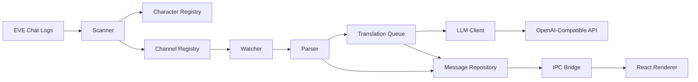
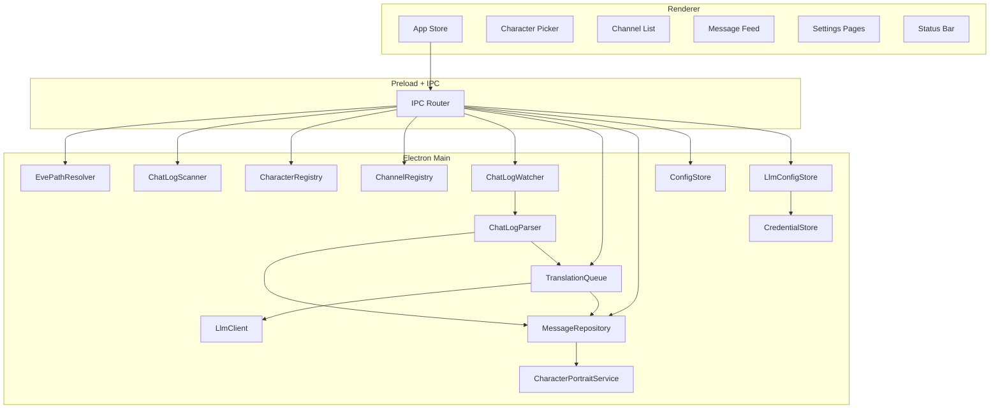

# EVE Babel

[English](./README.md) | [简体中文](./README.zh-CN.md) | [日本語](./README.ja.md) | Русский

<div align="center">

Настольное приложение для Windows с приоритетом на реальное время перевода логов чата EVE Online


</div>

## Обзор

EVE Babel - это настольное приложение для игроков EVE Online. Его основная цель - превратить локальные журналы чата Windows в поток сообщений, который удобно читать, контролировать по каналам и переводить в реальном времени.

Приложение автоматически находит локальный каталог логов чата EVE, сначала просит пользователя выбрать конкретного character, а затем перечисляет все доступные chat channel для этого character. После того как пользователь включает интересующие его каналы, приложение непрерывно отслеживает новый контент, добавляемый в эти лог-файлы, отправляет входящие сообщения в OpenAI-совместимый API для перевода и показывает в интерфейсе оригинал, перевод, статус и контекст.

Сейчас проект сфокусирован на одной очень конкретной цели MVP:

> найти логи, выбрать character, включить channel, отслеживать новые сообщения и надежно переводить их в реальном времени.

## Какую проблему это решает

Чат в EVE Online движется быстро, особенно в многоязычной среде. Игрокам часто приходится переключаться между игрой, сырыми лог-файлами и внешними инструментами перевода. Такое переключение создает лишний шум и замедляет реакцию.

EVE Babel создан, чтобы уменьшить это трение за счет более чистого рабочего процесса:

- автоматически находить чат-логи в Windows
- изолировать данные по character
- управлять переводом на уровне channel
- обрабатывать только вновь добавленные сообщения в реальном времени
- локально кэшировать последние сообщения и переводы

## Основные возможности

| Возможность | Описание |
| --- | --- |
| Автоматическое обнаружение логов | Находит каталог логов чата EVE в Windows Documents и при необходимости поддерживает ручную настройку |
| Workflow с выбором character вначале | Пользователь сначала выбирает character, и только затем отображаются и обрабатываются каналы и сообщения этого character |
| Обнаружение channel и opt-in управление | Доступные channel находятся автоматически, и только явно включенные попадают в конвейер живого перевода |
| Наблюдение за логами в реальном времени | Отслеживает активные лог-файлы чата и обрабатывает только новый добавленный контент |
| Параллельный показ оригинала и перевода | Одновременно показывает время, отправителя, channel, исходное сообщение, статус перевода и переведенный текст |
| Поддержка OpenAI-совместимых provider | Поддерживает OpenAI, DeepSeek, OpenRouter и пользовательские совместимые endpoint |
| Локальное хранение | Локально сохраняет последние сообщения, переводы, конфигурацию, provider profile и состояние выполнения |

## Текущий объём продукта

### Что входит в текущую версию

- настольный интерфейс с приоритетом на Windows
- автоматическое определение стандартного каталога логов
- ручной выбор каталога, если автоопределение не сработало
- выбор character до выбора channel
- список channel для выбранного character
- включение и pin каналов по отдельности
- живая лента сообщений со статусом перевода
- настраиваемый целевой язык
- настраиваемые OpenAI-совместимые provider profile
- кэш последних сообщений и переводов

## Как использовать

### Пользовательский поток

1. Запустите приложение.
2. EVE Babel сначала пытается автоматически найти локальный каталог логов чата EVE.
3. Если автообнаружение не удалось, пользователь может вручную выбрать правильный каталог.
4. Приложение сканирует каталог и формирует список доступных character.
5. Пользователь выбирает character, с которым хочет работать.
6. Приложение показывает все обнаруженные channel для этого character.
7. Пользователь включает channel, которые хочет отслеживать и переводить.
8. Новый чат-контент разбирается и отправляется в очередь перевода.
9. Результаты перевода возвращаются в UI и записываются в локальное хранилище.

### Поток данных во время работы



## Техническая архитектура

EVE Babel использует многослойную архитектуру Electron, где стабильность, безопасность и будущая расширяемость считаются приоритетами первого порядка.

### 1. Main process

Electron main process отвечает за все системные и чувствительные с точки зрения безопасности задачи:

- обнаружение и проверка каталога логов
- сканирование файлов и управление жизненным циклом watcher
- парсинг чат-логов UTF-16LE
- индексация character и channel
- оркестрация очереди перевода
- запросы к OpenAI-совместимым API
- локальное хранение и сохранение конфигурации
- работа с API key
- доставка событий выполнения в renderer

Это позволяет держать доступ к файловой системе, выполнение перевода и работу с учетными данными вне UI-слоя.

### 2. Preload bridge

Слой preload предоставляет renderer минимальный IPC API. Он служит контролируемой границей между React UI и привилегированным Electron main process.

Сейчас renderer может запрашивать такие действия, как:

- получение bootstrap-данных
- загрузка страниц сообщений канала
- выбор character
- включение или pin channel
- обновление настроек
- управление provider profile
- выбор каталога логов

Он также подписывается на push-события из main process для:

- обновления сообщений
- обновления состояния channel
- обновления статуса watcher и API
- обновления portrait персонажа

### 3. Renderer

React renderer отвечает за организацию и отображение пользовательского опыта продукта, включая:

- character picker
- список channel
- message feed
- страницы настроек
- status bar
- UI настройки provider

Сам renderer не читает файлы напрямую и не отправляет запросы на перевод напрямую.

### 4. Shared types

Структуры данных между процессами ограничены общими типами TypeScript. Ключевые модели включают:

- `CharacterSummary`
- `ChannelSummary`
- `ChatMessage`
- `ChatSessionFile`
- `TranslationJob`
- `AppConfig`
- `BootstrapPayload`
- `WatcherStatus`
- `ApiStatus`

Это делает IPC-контракт явным и уменьшает расхождение между main process и renderer.

## Обзор архитектуры



## Технологический стек

| Слой | Технология |
| --- | --- |
| Desktop Shell | Electron |
| Frontend | React 19 |
| Язык | TypeScript |
| Сборка | electron-vite + Vite |
| Наблюдение за файлами | chokidar |
| Локальное хранение данных | sql.js |
| i18n | i18next + react-i18next |
| Packaging | electron-builder |
| Тестирование | Vitest |

## Структура проекта

```text
src/
  main/
    ipc/
    services/
      channelRegistry.ts
      characterRegistry.ts
      chatLogParser.ts
      chatLogScanner.ts
      chatLogWatcher.ts
      configStore.ts
      credentialStore.ts
      evePathResolver.ts
      llmClient.ts
      llmConfigStore.ts
      messageRepository.ts
      translationQueue.ts
    main.ts
    preload.ts
  renderer/
    components/
      settings/
    i18n/
    store/
    App.tsx
    main.tsx
    styles.css
  shared/
    types.ts
spec/
  design_plan.md
scripts/
  prepare-package-output.ps1
```

## Модель данных и подход к парсингу логов

Структура логов чата EVE напрямую определяет стратегию реализации:

- логи приходят из локального каталога чата Windows
- имена файлов кодируют название channel, дату, время и character ID
- названия channel могут содержать пробелы, точки, скобки и неанглийские символы
- содержимое файлов нужно разбирать как UTF-16LE
- парсер должен устойчиво переносить повторяющиеся BOM-маркеры, метаданные заголовка, системные строки и частично записанные строки
- в режиме watch нужно обрабатывать только новый добавленный контент и не перечитывать всю историю без необходимости

Из-за этих ограничений проект намеренно разделяет обязанности scanner, watcher, parser, repository и translation queue, а не складывает все в UI.

## Безопасность и приватность

Границы безопасности рассматриваются как часть архитектуры.

- API-запросы отправляются из Electron main process
- renderer получает только разрешенный preload API
- API key хранятся локально и, если доступно, шифруются с помощью Electron `safeStorage`
- данные чата и переводы кэшируются локально для работы продукта, а не как отдельный конвейер аналитической выгрузки
- UI не требуется произвольный доступ к файловой системе или сети

## Локальная разработка

### Требования

- рекомендуется Windows
- Node.js LTS
- npm
- рабочий OpenAI-совместимый API endpoint и API key
- локально доступные чат-логи EVE Online

### Установка зависимостей

```bash
npm install
```

### Запуск среды разработки

```bash
npm run dev
```

### Запуск тестов

```bash
npm run test
```

### Проверка типов

```bash
npm run typecheck
```

### Сборка приложения

```bash
npm run build
```

### Генерация пакетированного вывода

```bash
npm run pack
```

### Генерация Windows-инсталлятора

```bash
npm run dist
```

## Первый запуск

При первом запуске ожидаемый поток такой:

1. приложение проверяет стандартный каталог логов чата EVE
2. если каталог отсутствует или недоступен, пользователь выбирает его вручную
3. приложение сканирует данные и показывает доступных character
4. пользователь выбирает активного character
5. пользователь открывает settings и настраивает provider перевода
6. пользователь включает channel, которые хочет переводить
7. новые сообщения чата начинают проходить через статусный конвейер и появляются с переводом

## Поддерживаемая модель Provider

Текущая реализация построена вокруг OpenAI-совместимых API и сейчас включает поддержку:

- OpenAI
- DeepSeek
- OpenRouter
- пользовательских совместимых endpoint

Цель в том, чтобы слой перевода оставался заменяемым, а не был жестко привязан к одному вендору.

## Стратегия тестирования

В репозитории уже есть модульные тесты для ключевых сервисов, таких как:

- парсинг логов чата
- сканирование каталогов
- поведение watcher
- логика очереди перевода
- LLM client и обработка конфигурации
- repository и логика выбора

Это сделано намеренно. Самые уязвимые части этого продукта - не визуальная раскладка, а обработка формата логов, инкрементальное чтение, оркестрация очереди и границы локального хранения.

## Пакетирование и распространение

Проект использует `electron-builder` для упаковки и сейчас нацелен на вывод Windows NSIS installer для x64 Windows.

## FAQ

### Почему пользователь должен выбрать character до выбора channel?

Потому что одно и то же имя channel может встречаться в наборах логов разных character. Выбор character вначале - самый чистый способ не смешивать несвязанные логи и сохранить четкую границу данных.

### Почему не переводить все channel по умолчанию?

Opt-in на уровне channel уменьшает шум, помогает контролировать стоимость API и гарантирует, что UI остается сфокусированным на том, что пользователю действительно важно.

## Отказ от ответственности

Это независимый проект и он не связан с CCP Games.
Если в результате использования этого программного обеспечения к аккаунту пользователя EVE Online будут применены какие-либо официальные меры, включая, помимо прочего, ограничения, приостановку или бан, данное программное обеспечение и его разработчики не несут никакой ответственности.