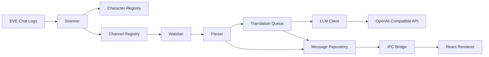
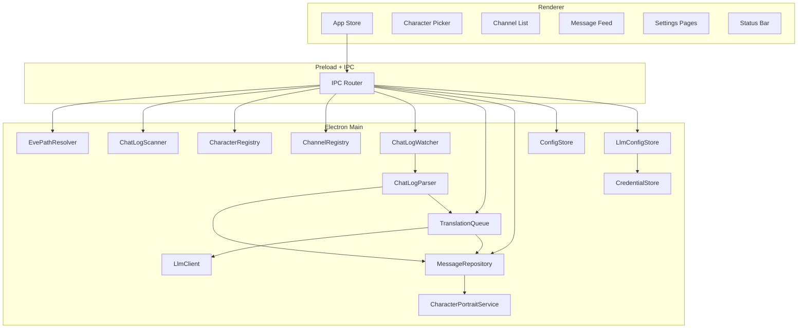

# EVE Babel

[English](./README.md) | 简体中文 | [日本語](./README.ja.md) | [Русский](./README.ru.md)

<div align="center">

面向 Windows 的 EVE Online 实时聊天日志翻译桌面应用


</div>

## 项目简介

EVE Babel 是一个为 EVE Online 玩家打造的桌面应用，核心目标是在 Windows 环境下，把本地聊天日志转换成一个可持续查看、可按频道控制、可实时翻译的消息流界面。

应用会自动发现本地 EVE 聊天日志目录，先让用户选择具体角色，再基于该角色枚举全部可用频道。用户勾选需要关注的频道后，应用会持续监听这些频道对应日志文件的新内容，并通过 OpenAI 兼容接口完成实时翻译，在界面中同时展示原文、译文、状态和上下文信息。

这个项目当前聚焦于一个非常明确的 MVP 目标：

> 自动发现日志，选择角色，启用频道，监听新增消息，并稳定地完成实时翻译展示。

## 这个项目解决什么问题

EVE Online 的聊天信息变化很快，尤其是在多语言环境里，玩家经常需要在游戏窗口、日志文件和外部翻译工具之间反复切换。这种切换会打断注意力，也会降低对实时信息的反应速度。

EVE Babel 试图把这件事收敛成一个更干净的工作流：

- 自动发现 Windows 下的聊天日志
- 以角色为边界隔离不同日志集合
- 以频道为粒度控制是否翻译
- 对新增消息进行实时处理
- 本地缓存最近消息和译文结果

## 核心功能

| 功能 | 说明 |
| --- | --- |
| 自动发现日志目录 | 优先检测 Windows Documents 下的 EVE 聊天日志路径，并支持手动覆盖 |
| 角色优先流程 | 先选 character，再看该 character 对应的频道与消息，避免不同角色日志混淆 |
| 频道发现与启用控制 | 自动列出可用频道，只有用户明确启用的频道才会进入实时翻译流程 |
| 实时日志监听 | 监听活跃日志文件的新增内容，只处理新追加的消息 |
| 原文与译文同屏展示 | 同时显示时间、发送者、频道、原文、翻译状态和译文 |
| OpenAI 兼容接口支持 | 当前支持 OpenAI、DeepSeek、OpenRouter 与自定义兼容接口配置 |
| 本地持久化 | 本地保存最近消息、译文、配置、Provider Profile 和运行状态 |

## 当前产品范围

### 已纳入当前版本的内容

- Windows 优先桌面体验
- 默认日志目录自动检测
- 自动检测失败时的手动目录选择
- 先选角色、后选频道的使用流程
- 所选角色下的频道列表展示
- 频道启用与置顶控制
- 带翻译状态的实时消息流
- 可配置目标语言
- 可配置 OpenAI 兼容 Provider Profile
- 最近消息与译文缓存

## 使用方式

### 用户侧流程

1. 启动应用。
2. EVE Babel 会优先自动定位本地 EVE 聊天日志目录。
3. 如果自动发现失败，用户可以手动选择正确目录。
4. 应用扫描目录中的日志文件并生成角色列表。
5. 用户选择当前要使用的 character。
6. 应用展示该 character 下已发现的全部频道。
7. 用户启用想要关注和翻译的频道。
8. 新增聊天内容被解析后进入翻译队列。
9. 译文结果回推到界面，并写入本地缓存。

### 运行时数据流



## 技术架构

EVE Babel 采用分层的 Electron 架构，目标是把稳定性、安全性和后续扩展性优先放在设计中心。

### 1. Main process

Electron 主进程负责所有系统能力和安全敏感能力：

- 日志目录发现与校验
- 文件扫描与 watcher 生命周期管理
- UTF-16LE 聊天日志解析
- character 与 channel 索引维护
- 翻译队列调度
- OpenAI 兼容接口请求
- 本地持久化与配置存储
- API Key 管理
- 向 renderer 推送运行时事件

这种设计把文件系统访问、翻译调用和密钥处理留在 UI 之外，边界更清晰。

### 2. Preload bridge

Preload 层通过最小化 IPC API 向 renderer 暴露能力，是 React UI 与 Electron 主进程之间的受控桥接层。

Renderer 当前可以请求的能力包括：

- 获取 bootstrap 数据
- 拉取频道消息分页
- 选择角色
- 启用或置顶频道
- 更新设置
- 管理 Provider Profile
- 选择日志目录

同时也会订阅主进程主动推送的事件：

- 消息更新
- 频道状态更新
- watcher 与 API 状态更新
- 角色头像更新

### 3. Renderer

React renderer 负责产品界面的组织与呈现，包括：

- 角色选择界面
- 频道列表
- 消息流界面
- 设置页
- 状态栏
- Provider 配置 UI

Renderer 本身不直接读文件，也不直接发起翻译请求。

### 4. Shared types

跨进程数据结构通过共享 TypeScript 类型统一约束，核心模型包括：

- `CharacterSummary`
- `ChannelSummary`
- `ChatMessage`
- `ChatSessionFile`
- `TranslationJob`
- `AppConfig`
- `BootstrapPayload`
- `WatcherStatus`
- `ApiStatus`

这样可以把 IPC 契约显式化，减少 main 与 renderer 之间的类型漂移。

## 架构总览



## 技术栈

| 层级 | 技术 |
| --- | --- |
| Desktop Shell | Electron |
| Frontend | React 19 |
| Language | TypeScript |
| Build Tooling | electron-vite + Vite |
| File Watching | chokidar |
| Local Data Storage | sql.js |
| i18n | i18next + react-i18next |
| Packaging | electron-builder |
| Testing | Vitest |

## 项目结构

```text
src/
  main/
    ipc/
    services/
      channelRegistry.ts
      characterRegistry.ts
      chatLogParser.ts
      chatLogScanner.ts
      chatLogWatcher.ts
      configStore.ts
      credentialStore.ts
      evePathResolver.ts
      llmClient.ts
      llmConfigStore.ts
      messageRepository.ts
      translationQueue.ts
    main.ts
    preload.ts
  renderer/
    components/
      settings/
    i18n/
    store/
    App.tsx
    main.tsx
    styles.css
  shared/
    types.ts
spec/
  design_plan.md
scripts/
  prepare-package-output.ps1
```

## 数据模型与日志解析思路

EVE 聊天日志的格式特征直接决定了项目的实现方式：

- 日志来自本地 Windows 聊天目录
- 文件名中同时编码了频道名、日期、时间和角色 ID
- 频道名可能包含空格、点号、括号以及中文等非英文字符
- 文件内容需要按 UTF-16LE 解析
- 解析器必须容忍重复 BOM、头部元信息、系统消息和半写入行
- 监听时只能消费新增内容，不能重复处理历史内容

正因为这些约束存在，项目才拆分出了 scanner、watcher、parser、repository、translation queue 这些职责明确的组件，而不是把所有逻辑直接塞进 UI。

## 安全与隐私

这个项目把安全边界当作架构的一部分来处理。

- API 请求在 Electron main process 中发起
- renderer 只拿到白名单形式的 preload API
- API Key 保存在本地，并在可用时使用 Electron `safeStorage` 做加密存储
- 聊天记录和译文会为了产品体验做本地缓存，但不会额外作为独立分析流水线上传
- UI 本身不需要获得任意文件系统或任意网络能力

## 本地开发

### 环境要求

- 推荐使用 Windows 环境
- Node.js LTS
- npm
- 可用的 OpenAI 兼容接口与 API Key
- 本地可访问的 EVE Online 聊天日志

### 安装依赖

```bash
npm install
```

### 启动开发环境

```bash
npm run dev
```

### 运行测试

```bash
npm run test
```

### 运行类型检查

```bash
npm run typecheck
```

### 构建应用

```bash
npm run build
```

### 生成打包目录

```bash
npm run pack
```

### 生成 Windows 安装包输出

```bash
npm run dist
```

## 首次使用流程

第一次启动 EVE Babel 时，典型流程如下：

1. 应用检查默认的 EVE 聊天日志目录。
2. 如果目录不存在或不可用，用户手动选择正确目录。
3. 应用扫描并列出可用角色。
4. 用户选择当前角色。
5. 用户进入设置页配置翻译 Provider。
6. 用户启用需要翻译的频道。
7. 新增聊天消息开始按状态流转并展示译文。

## 当前支持的 Provider 模式

当前实现围绕 OpenAI 兼容接口构建，内置支持以下 Provider 类型：

- OpenAI
- DeepSeek
- OpenRouter
- 自定义兼容接口

这样做的目的，是让翻译层保持可替换性，而不是把产品死绑在单一服务商上。

## 测试策略

仓库当前已经包含一组围绕核心服务的单元测试，主要覆盖：

- 聊天日志解析
- 目录扫描
- watcher 行为
- 翻译队列逻辑
- LLM Client 与配置处理
- Repository 与筛选逻辑

这是刻意的设计选择。这个项目真正容易出错的部分不是 UI 排版，而是日志格式处理、增量读取、队列调度和本地持久化边界。

## 打包与发布

项目使用 `electron-builder` 打包，当前主要面向 Windows NSIS 安装包输出，目标架构为 x64 Windows。

## FAQ

### 为什么必须先选角色，再选频道？

因为相同频道名可能同时出现在不同角色的日志集合里。先选角色是避免日志混淆、建立清晰数据边界的最稳妥方式。

### 为什么不是默认翻译所有频道？

频道级启用可以减少噪音、控制 API 成本，也能保证界面里展示的是用户真正关心的内容。

## 免责声明

本项目为独立开发项目，与 CCP Games 无官方隶属关系。
如果用户因使用本软件导致其 EVE Online 账号受到官方采取的任何措施，包括但不限于限制、暂停或封禁，本软件及其开发者不承担任何责任。